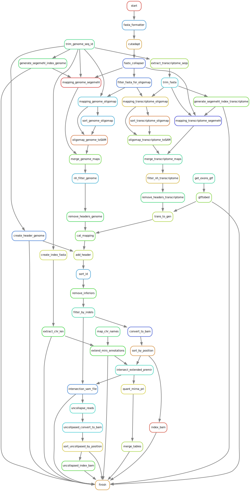

# mir-prepare-annotation

[Snakemake] workflow for download and prepare the necessary files for smallRNA-seq related pipelines.

The scheme below is a visual representation of an example run of the
workflow:  

> 

## Installation

### Installing Singularity

For improved reproducibility and reusability of the workflow, as well as an
easy means to run it on a high performance computing (HPC) cluster managed,
e.g., by [Slurm], each individual step of the workflow runs in its own container. 
Specifically, containers are created out of [Singularity] images
built for each software used within the workflow. As a consequence, running
this workflow has very few individual dependencies. It does, however, require
that Singularity be installed. See the links below for installation
instructions for the most up-to-date (as of writing) as well as for the tested
version (2.6.1) of Singularity:

- [Singularity v3.5](https://sylabs.io/guides/3.5/user-guide/quick_start.html)
- [Singularity v2.6](https://sylabs.io/guides/2.6/user-guide/installation.html)

### Setting up a Snakemake virtual environment

In addition to Singularity, [Snakemake] needs to be installed. Is strongly
recommended to do so via a virtual environment. Here are described the steps
necessary to set up such a virtual environment with a recent version (v4.4+) of
the `conda` package manager. If you prefer to use another solution, such as
`virtualenv`, adapt the steps according to the specific instructions of your
preferred solution.

If you do not have `conda` installed for Python3, it is recommended to install the
minimal version (Python and package manager) [Miniconda] (see the link for
installation instructions). Be sure to select the correct version for your
operating system and ensure that you select the Python 3 option.

To create and activate the environment, run:

```bash
conda create -n mir_pipeline \
    -c bioconda \
    -c conda-forge \
    snakemake=5.4.0
conda activate mir_pipeline
```

### Cloning the repository

Traverse to the desired path on your file system, then clone the repository and
move into it with:

```bash
git clone ssh://git@git.scicore.unibas.ch:2222/zavolan_group/pipelines/mir-prepare-annotation.git
cd mir-prepare-annotation
```

All installation requirements should now be met with.

## Testing

Several tests are prepared to check the integrity of the workflow. 
* For workflow DAG generation run: 
```bash
./test/test_dag.sh
```
* To execute the test on workflow integration run:
```bash
./test/test_workflow.sh
```

## Usage

* Main configuration file: `config.yaml` in root directory contains all the paths needed for successful Snakemake 
workflow execution as well as all the parameters for a proper set up for the posterior miRNA sequences analysis. 
Please go carefully through all the entries and adjust them according to your desires.

* To start the workflow run:
```bash
./run_pipeline.sh
```

After succesfully execution of the workflow results and logs outputs will be found in `results/` and `logs/` directories. 


> **NOTE:** Depending on the configuration of your Slurm installation or if using a different workflow manager, 
> you may need to adapt file `cluster.json` and the arguments to options `--config` and `--cores` in file
> `run_pipeline.sh`, both located in root directory. Consult the manual of your workload manager as well as the section of the
> Snakemake manual dealing with [cluster execution].


[Snakemake]: <https://snakemake.readthedocs.io/en/stable/>
[Singularity]: <https://sylabs.io/singularity/>
[Miniconda]: <https://docs.conda.io/en/latest/miniconda.html>
[cluster execution]: <https://snakemake.readthedocs.io/en/stable/executing/cluster-cloud.html#cluster-execution>
[Slurm]: <https://slurm.schedmd.com/documentation.html>

