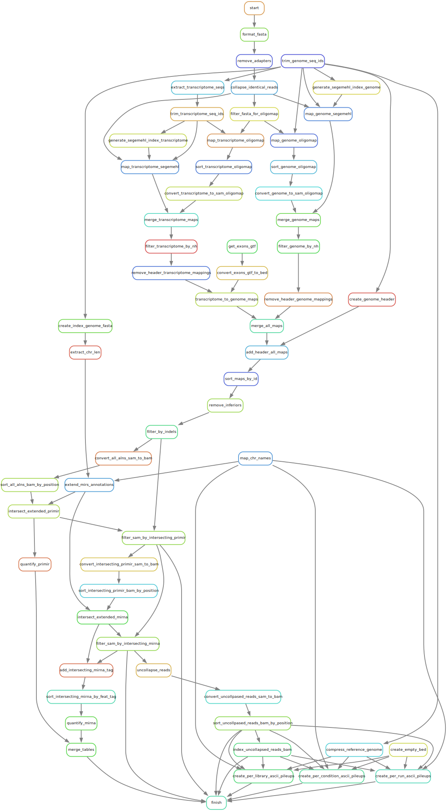

# mir-prepare-annotation

[Snakemake] workflow for download and prepare the necessary files for smallRNA-seq related pipelines.

The scheme below is a visual representation of an example run of the
workflow:  

> 

## Installation

### Cloning the repository

Traverse to the desired path on your file system, then clone the repository and
move into it with:

```bash
git clone ssh://git@git.scicore.unibas.ch:2222/zavolan_group/pipelines/mir-prepare-annotation.git
cd mir-map
```
### Setting up a virtual environment

Workflow dependencies can be conveniently installed with the [Conda][conda]
package manager. We recommend that you install [Miniconda][miniconda-installation] for your system.

Create and activate the environment with necessary dependencies with conda:

```bash
conda env create -f environment.yml
```

For improved reproducibility and reusability of the workflow, as well as an
easy means to run it on a high performance computing (HPC) cluster managed,
e.g., by [Slurm][slurm], each individual step of the workflow runs in its own container. 
Specifically, containers are created out of [Singularity][singularity] images
built for each software used within the workflow. As a consequence, running
this workflow has very few individual dependencies. It does, however, require
that [Singularity][singularity] to be installed. 

## Testing
Several tests are prepared to check the integrity of the workflow. 
Move into `test/` directory:
```bash
cd test/
```

## DAG and rule graph
Execute the following commands to generete DAG and rule graph images. Outputs will be found in `images/` folder. 
```bash
./test_dag.sh
./test_rule_graph.sh
```
### Run workflow on local machine
Execute the following command to run the test workflow on your local machine:
```bash
./test_workflow_local.sh
```

### Run workflow via Slurm
Execute the following command to run the test workflow on a Slurm-managed high-performance computing (HPC) cluster::
```bash
./test_workflow_slurm.sh
```

## Usage

Assuming that you are currently inside the repository's root directory...

* To run the pipeline with your own samples:
```bash
cd RUN_JOB
```
Before running the pipeline adjust the parameters in `config.yaml`file.  
To start pipeline execution locally:
```bash
./run_workflow_local.sh
```
To start pipeline execution in Slurm: 
> *Recommended due to resources needs*

```bash
./run_workflow_slurm.sh
```
After succesfully execution of the workflow results and logs outputs will be found in `results/` and `logs/` directories. 


> **NOTE:** Depending on the configuration of your Slurm installation or if using a different workflow manager, 
> you may need to adapt file `cluster.json` (located in root directory) and the arguments to options `--config` and `--cores` in file
> `run_workflow_slurm.sh`, located in RUN_JOB directory. Consult the manual of your workload manager as well as the section of the
> Snakemake manual dealing with [cluster execution].


[conda]: <https://docs.conda.io/projects/conda/en/latest/index.html>
[cluster execution]: <https://snakemake.readthedocs.io/en/stable/executing/cluster-cloud.html#cluster-execution>
[miniconda-installation]: <https://docs.conda.io/en/latest/miniconda.html>
[rule-graph]: images/rule_graph.svg
[snakemake]: <https://snakemake.readthedocs.io/en/stable/>
[singularity]: <https://sylabs.io/singularity/>
[slurm]: <https://slurm.schedmd.com/documentation.html>


[Snakemake]: <https://snakemake.readthedocs.io/en/stable/>
[Singularity]: <https://sylabs.io/singularity/>
[Miniconda]: <https://docs.conda.io/en/latest/miniconda.html>
[cluster execution]: <https://snakemake.readthedocs.io/en/stable/executing/cluster-cloud.html#cluster-execution>
[Slurm]: <https://slurm.schedmd.com/documentation.html>

